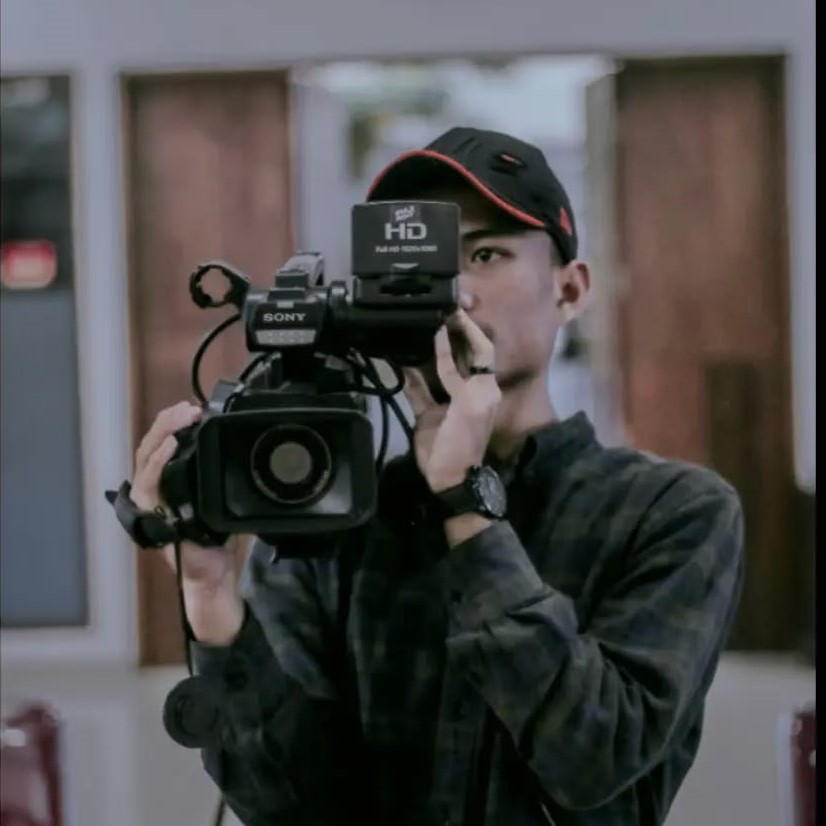

<!DOCTYPE html>
<html lang="id">
<head>
    <meta charset="UTF-8">
    <meta name="viewport" content="width=device-width, initial-scale=1.0">
    <title>Resume Fauzi Tri Hermawan</title>
    <link rel="stylesheet" href="style.css">
</head>
<body>
    

        

            
            <h1>FAUZI TRI HERMAWAN</h1>
            <h2>FOTOGRAFER & MEKANIK</h2>
            

                
+6281312647953

                
Fauzitri2511@gmail.com

                
<a href="https://www.linkedin.com/in/fauzi-tri-hermawan-26b34a298/" target="_blank">LinkedIn Profile</a>

                
Komp. Griya Bandung Indah blok 10 No.18

            

        </body>
        

        

            <h3>PROFIL</h3>
            
menyelesaikan pendidikan SMA jurusan MIPA, saya memiliki minat di bidang dokumentasi, editing, dan mekanik. Lulus dengan nilai memuaskan dan aktif berorganisasi (procedio). Memiliki pengalaman mengerjakan short film, cinematografi, fotografi, yang dimana hal tersebut dapat mengasah keterampilan yang dibutuhkan divisi kreatif.

            <h3>PENDIDIKAN</h3>
            
<strong>(2020-2023) SMAN 22 BANDUNG</strong>  Jurusan MIPA

            
<strong>(2024-Sekarang) Universitas Logistik Dan Bisnis Internasional</strong> Jururan D3Teknik Informatika

            <h3>KEMAMPUAN</h3>
            <ul>
                <li>Microsoft Office (Dasar)</li>
                <li>Adobe Lightroom</li>
                <li>Adobe PhotoShop (Dasar) </li>
                <li>Adobe Premiere Pro (Dasar)</li>
            </ul>

            <h3>PENGALAMAN</h3>
            <ul>
                <li><strong>COO PH MUFAZAPROJECT (2021 - Sekarang)</strong> - Mengembangkan brand jasa fotografi dan videografi.</li>
                <li><strong>ANGGOTA PER FILM AN PROCIDO (2020-2023)</strong> - Sukses melaksanakan pembuatan short film.</li>
                <li><strong>Pelatihan Otomotif BBPV BANDING (Agustus 2023 - Oktober 2023)</strong> - Merancang sistem operasi pada mesin.</li>
                <li><strong>Staff Marketing PT. Honda Naga Mas (Desember 2023 - Desember 2023)</strong> - Memasarkan dan menjual motor sesuai target.</li>
            </ul>
            <h3>SERTIFIKAT</h3>
            <ul>
                <li><strong>SERTIFIKAT BNSP PELATIHAN OTOMOTIF </strong> 
                    <li><strong>SERTIFIKAT PELATIHAN BALAI BESAR PELATIHAN VOKASI DAN PRODUKTIVITAS BANDUNG </strong> 
            </ul>
        

    

    
</body>
</html>
